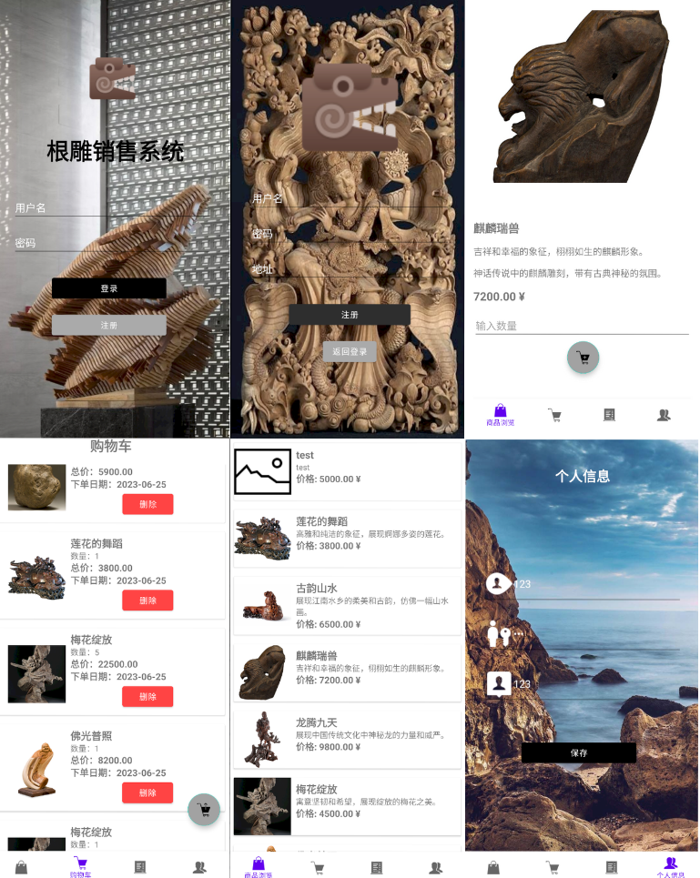
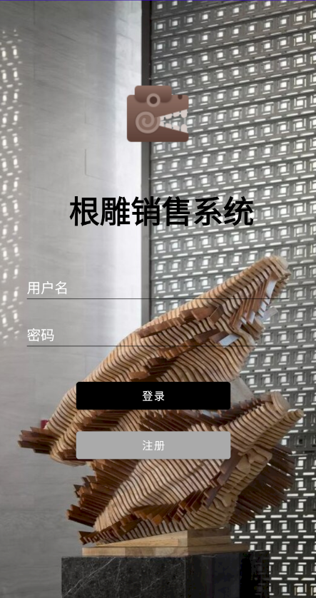
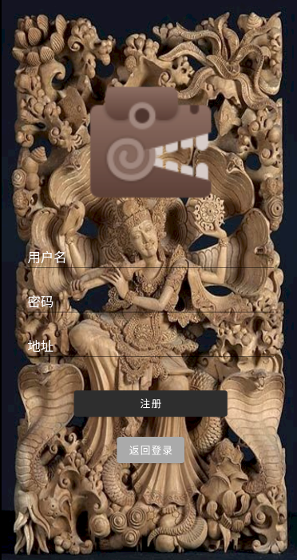
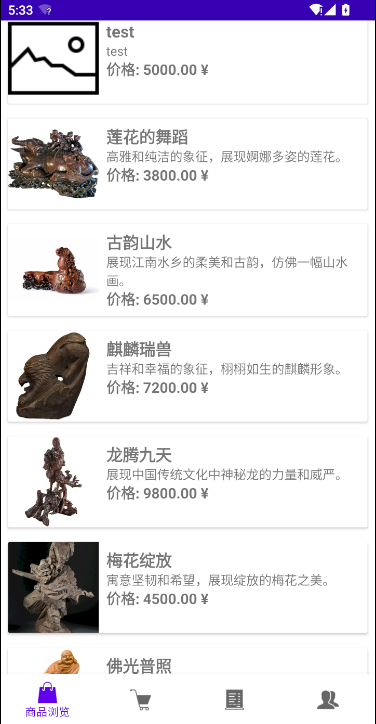
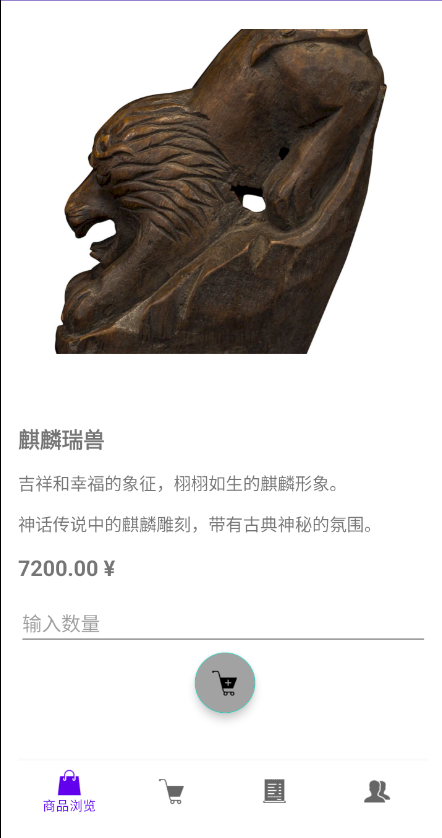
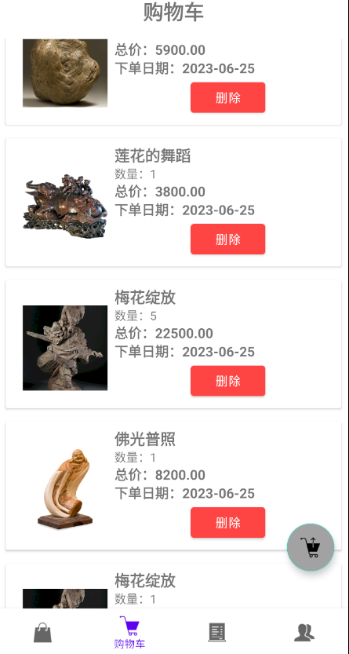
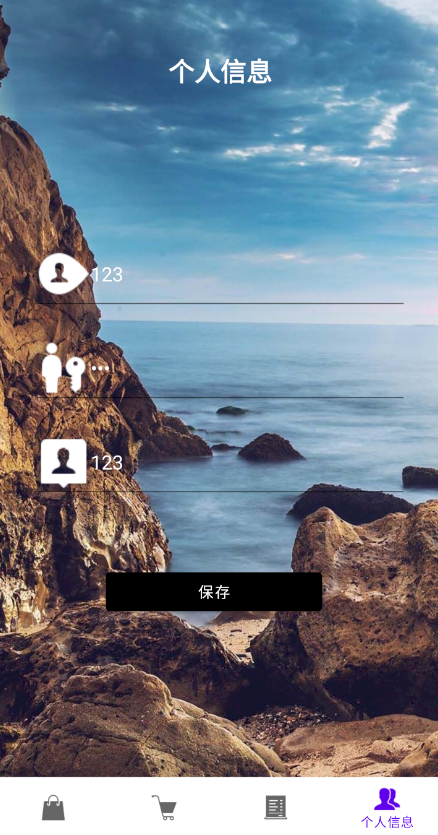

界面拼图:

登录拼图:

注册拼图:

商品浏览拼图:

商品详情拼图:

购物车拼图:

个人档案拼图:

根雕艺术品销售系统是一个面向用户的电子商务平台，旨在为用户提供方便的根雕艺术品购买和交易体验。根雕艺术品在市场上有一定的受众群体，这些群体对于根雕艺术品的品质、独特性和收藏价值有一定的了解和兴趣。通过开发这个系统，可以满足用户对根雕艺术品的购买需求，并提供方便的交易和管理功能。

# rootSale

- 项目功能
    - 用户注册和登录
        
        用户可以进行注册，提供必要的个人信息来创建账户
        
        注册后的用户可以使用提供的用户名和密码进行登录
        
    - 商品浏览界面
        
        用户可以浏览根雕艺术品的列表，显示每件艺术品的基本信息和缩略图
        
        用户可以点击某件艺术品进入详情界面，查看更多详细信息
        
    - 购物车查看界面
        
        用户可以查看已添加至购物车的艺术品列表，显示每件艺术品的基本信息和数量
        
        用户可以对购物车中的艺术品进行数量调整或删除操作
        
        用户可以一键结算购物车中的所有艺术品，生成订单
        
    - 订单查看界面
        
        用户可以查看已生成的订单列表，显示每个订单的基本信息和状态
        
        用户可以对订单进行删除操作，删除已完成或不需要的订单
        
    - 个人信息修改界面
        
        用户可以查看和修改个人信息，如用户名、密码和地址等
        
        用户可以修改个人信息后保存更改
        
    - 商品详情界面
        
        用户可以在商品浏览界面点击某件艺术品进入详情界面
        
        详情界面显示艺术品的详细信息，包括名称、描述、价格和图片等
        
        用户可以将感兴趣的艺术品添加至购物车
        
- 项目结构
    - 前端
        - 技术栈
            - Retrofit: 用于发送网络请求和处理API接口调用。通过配置Retrofit实例、定义服务接口以及使用回调函数处理请求结果，实现了与服务器的通信。
            - OkHttp: 作为Retrofit的底层网络传输库，用于处理HTTP请求和响应。
            - Gson: 用于解析服务器返回的JSON数据。
            - Picasso: 用于加载和显示图片。
        - 结构
            - activity: 存放各个Activity类，负责处理用户界面的展示和交互逻辑。
            - adapter: 存放适配器类，用于RecyclerView或ListView等组件的数据绑定和视图展示。
            - constant: 存放常量类，包含一些项目中使用的常量值。
            - model: 存放数据模型类，用于表示从服务器获取的数据结构。
            - service: 存放服务接口类，定义了与服务器进行通信的API接口。
            
    - 后端
        - 技术栈
            - Spring Boot：Spring Boot是一个用于简化Spring应用程序开发的框架，提供了自动配置、快速开发等特性，使得Spring应用程序的构建更加简单和高效。
            - Spring Data JPA：Spring Data JPA是Spring框架的一个模块，提供了对JPA（Java Persistence API）的支持，简化了对数据库的访问和操作。
            - MySQL Connector/J：MySQL Connector/J是MySQL官方提供的Java连接器，用于与MySQL数据库进行通信。
            - Commons IO：Commons IO是Apache Commons项目的一部分，提供了一组用于处理I/O操作的实用工具类。
        - 项目
            - config：该包用于存放项目的配置类，包括数据库配置、安全配置等。
            - controller：该包用于存放控制器类，处理HTTP请求和响应，负责接收和处理客户端请求，并返回相应的数据或视图。
            - entity：该包用于存放实体类，通常与数据库中的表映射，用于定义数据结构和对象模型。
            - repository：该包用于存放数据访问层的接口，通常用于定义对数据库进行增删改查操作的方法。
        - 设计模式
            
            项目采用了常见的MVC（Model-View-Controller）设计模式，通过控制器（controller）处理请求，访问数据时使用了Spring Data JPA提供的Repository接口，使用MySQL作为数据库
            
- 最佳实践
    1. 模块化的代码结构：代码按照功能进行了模块化组织，使用了不同的类和包来分离不同的功能模块，如Activity、Service等。这种结构可以提高代码的可维护性和可扩展性。
    2. 异步网络请求：通过使用Retrofit的**`enqueue`**方法，你以异步方式发送网络请求并处理响应。这可以避免在主线程上执行网络请求而导致的应用程序假死。
    3. 使用SharedPreferences进行数据存储：你使用了SharedPreferences来存储用户ID等信息，这是一种简单而轻量级的数据存储方式，适用于存储较小量的简单数据。
    4. 使用合适的类和方法命名：你的代码中使用了描述性的类和方法命名，这有助于他人理解代码的功能和目的，以及提高代码的可读性。
    5. 使用第三方库简化开发：你使用了一些常用的第三方库，如Picasso、OkHttp和Retrofit，这些库提供了方便的功能和抽象，可以简化开发流程，并提高代码的可维护性和性能。
    6. 错误处理：你的代码中包含了对网络请求的响应进行错误处理的逻辑，包括处理成功响应和失败响应的情况，并通过Toast消息向用户提供相应的反馈。
    
- Genymotion
    
    Genymotion是一款流行的第三方Android模拟器，它提供了快速、高性能的模拟器环境，可用于开发、测试和运行Android应用程序。
    
    与Android官方提供的模拟器相比，Genymotion具有更快的启动速度和响应速度，并且提供了更多的定制和调试选项。它支持在不同的Android版本和设备上运行应用程序，以及模拟不同的硬件特性和传感器。
    
    1. 快速启动和高性能：Genymotion模拟器启动速度快，并且在运行应用程序时具有良好的性能，可以更高效地进行开发和测试工作。
    2. 多设备支持：Genymotion支持模拟不同的Android设备，包括各种手机和平板电脑，使开发人员能够在不同设备上测试和优化应用程序。
    3. 定制选项：Genymotion提供了许多定制选项，如模拟网络连接、GPS位置、传感器数据等，可以模拟各种场景和条件，帮助开发人员进行更全面的测试。
    4. 调试功能：Genymotion提供了丰富的调试功能，包括ADB访问、日志记录、控制台和性能监视器等工具，有助于开发人员快速定位和解决问题。
- 学习
    - Model vs Entity
        
        模型类是用于描述数据的工具，而实体类则是与数据库中的数据相关联的工具。模型类更关注数据的结构和业务逻辑，而实体类更关注数据的持久化和与数据库的交互。